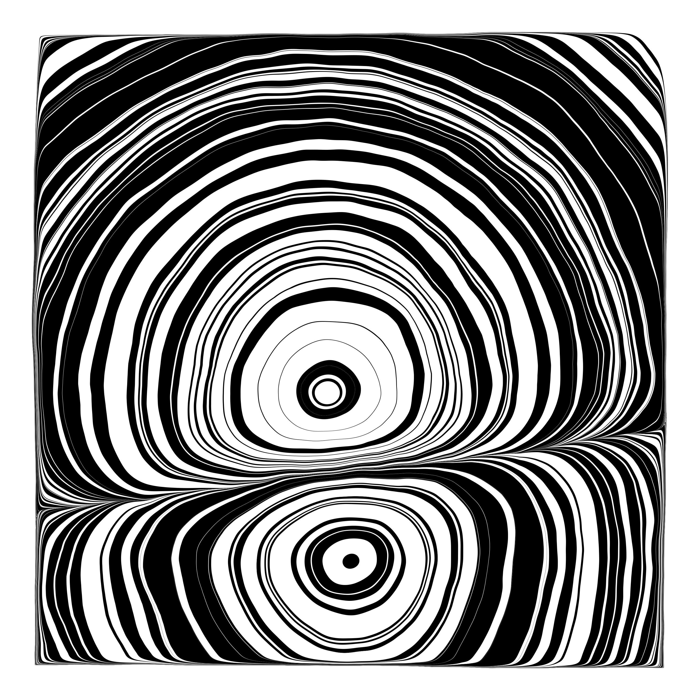
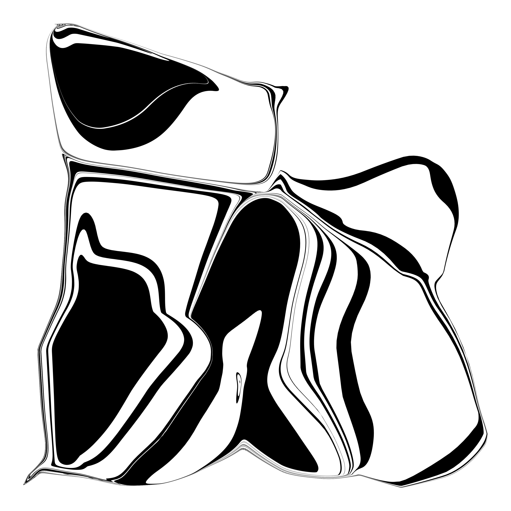
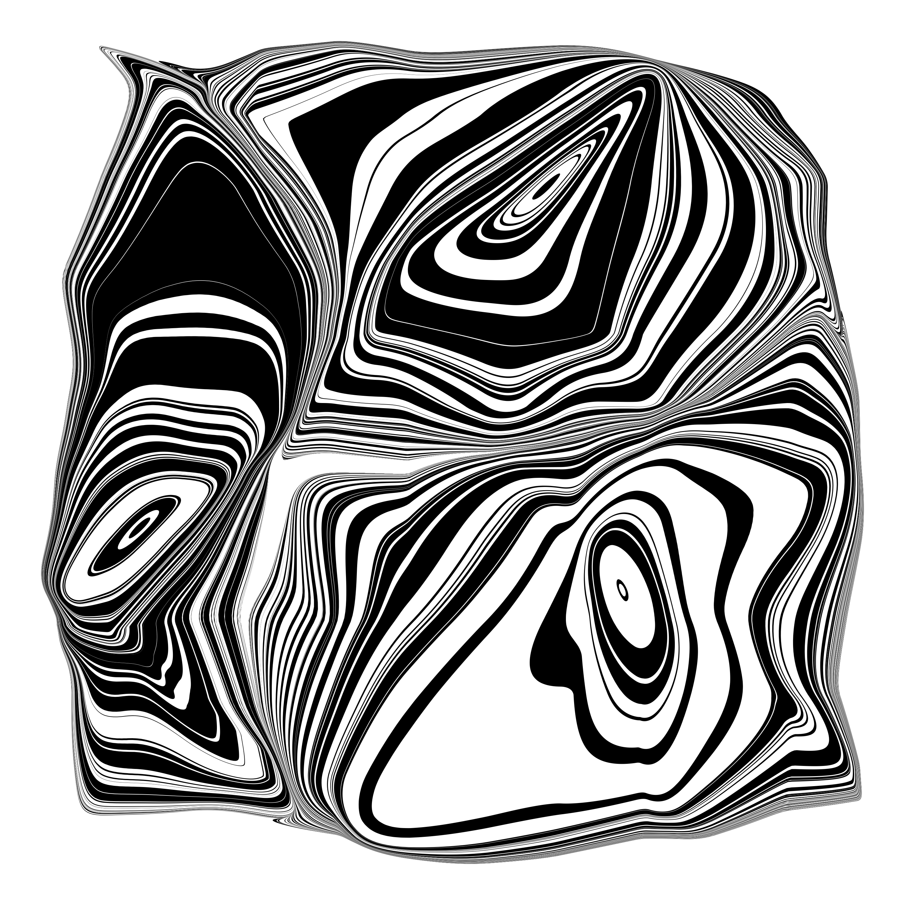
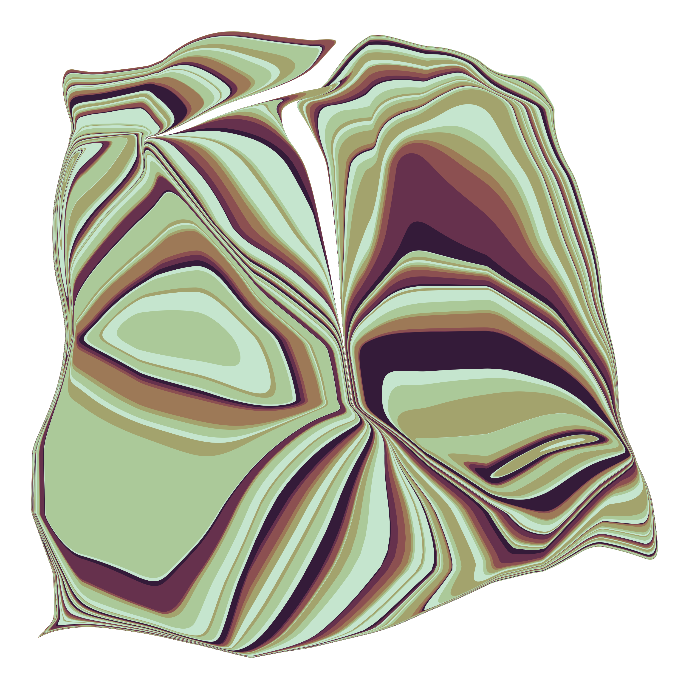

# Suminagashi

[Suminagashi](https://en.wikipedia.org/wiki/Paper_marbling#History_in_East_Asia) (_floating ink_) is a Japanese paper and cloth marbling technique. The procedure is to transfer ink of alternating colors with brushes on a water surface. After warping the initial ring structures by either blowing or fanning air onto the surface, the marble structure is transferred to a paper by just putting it on the water.

`suminagashi.py` contains a python function that tries to reproduce the suminagashi process with `numpy`, `scipy`, `matplotlib`, and `seaborn`. When running the script directly (`python suminagashi.py`), it should produce an example suminagashi image.

### How it works?
First, a number of circles of uniformly distributed radii around a number of sources of random origins are constructed. Second, the circles are transformed such that they stay within a square region and do not interfere with each other. (Here is still a minor bug that appears for `nr_sources > 2`...). Third, a continuous random potential is generated that follows a power law in it's spectral density distribution (you don't have to understand that part). The gradient of this potential is used as a static vector field that warps the set of circles by mapping each circle point over a number of iterations. Finally, the circles are plotted on top of each other starting with the largest radius for each source.

Please do not expect the code to run stable in all possible parameter configurations. It is just a Sunday afternoon project that I pursued until it worked to my satisfaction. See below for a few example images.

